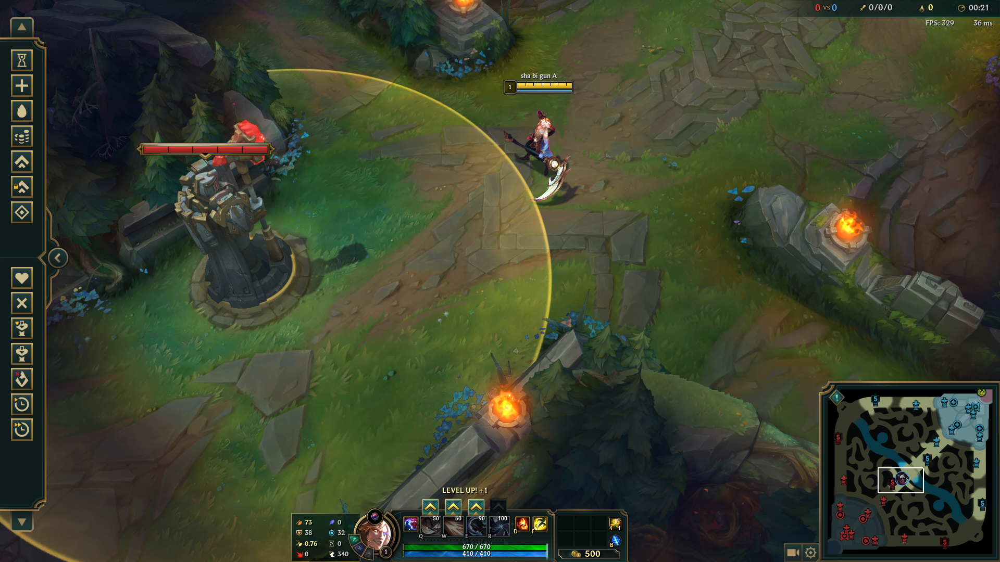

# Rank Note

by **XingyuZhou**

---

- [Rank Note](#rank-note)
  - [Acquired Experience](#acquired-experience)
  - [Attack Range](#attack-range)
  - [兵线](#兵线)

## Acquired Experience

英雄升级所需经验（每级 +100）：

| Level      | Exp. | Level       | Exp. |
| ---------- | ---- | ----------- | ---- |
| 1 $\to$ 2  | 280  | 10 $\to$ 11 | 1180 |
| 2 $\to$ 3  | 380  | 11 $\to$ 12 | 1280 |
| 3 $\to$ 4  | 480  | 12 $\to$ 13 | 1380 |
| 4 $\to$ 5  | 580  | 13 $\to$ 14 | 1480 |
| 5 $\to$ 6  | 680  | 14 $\to$ 15 | 1580 |
| 6 $\to$ 7  | 780  | 15 $\to$ 16 | 1680 |
| 7 $\to$ 8  | 880  | 16 $\to$ 17 | 1780 |
| 8 $\to$ 9  | 980  | 17 $\to$ 18 | 1880 |
| 9 $\to$ 10 | 1080 |             |      |

经验获取：

| Unit                 | Exp. | Unit     | Exp. |
| -------------------- | ---- | -------- | ---- |
| Melee Creeps (MC)    | 60   | Red Buff | 110  |
| Remote Soldier (RS)  | 30   |          |      |
| Artillery Corps (AC) | 93   |          |      |
| Super Soldier        | 92   |          |      |

$$
\begin{aligned}
  \text{普通线} &= 3\times\text{MC} + 3\times\text{RS} &= 270 \\
  \text{跑车线} &= \text{普通线} + 1\times\text{AC} &= 363 \\
\end{aligned}
$$

$$
\begin{aligned}
  \text{Lv. 2} &= 280 & &\leq & &1\times\text{普通线} + 1\times\text{RS} = 300 \\
  \text{Lv. 3} &= 660 & &\leq & &2\times\text{普通线} + 2\times\text{MC} = 660 \\
  \text{Lv. 6} &= 2400 & &\leq & &6\times\text{普通线} + 2\times\text{跑车线} + 2\times\text{MC} = 2466 \\
\end{aligned}
$$

## Attack Range

TOP:

MID:

AD:

⚠️ : 防御塔攻击范围随*英雄体型大小*变化！

## 兵线

1. 每 30s 来一波兵线
2. 2 波普通线，1 波跑车线
3. 中路 `01:30` 到达第一波兵
4. 第三波跑车线，两个近战兵升 3 级
5. 第九波跑车线（`05:30`），两个近战兵升 6 级

留 4 个远程兵即可卡线

先清完第五波兵可以考虑回城